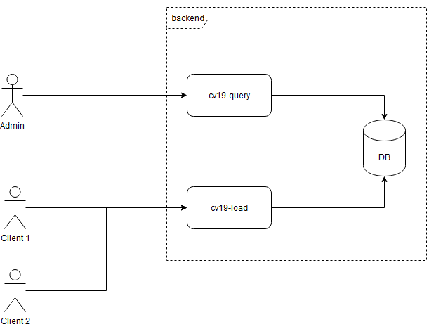

# COVID19

## Intro

Sistema para la contabilización y consulta de casos de Covid 19.

Se pueden tener varios "Clientes" que pueden realizar la carga de los casos, esto debido a que es posible tener centros de carga ubicados en distintas zonas geográficas.
Por otro lado, sólo puede haber un "Admin" que es el que puede realizar las consultas de los datos.


Representación del sistema:  


## Características

- El sistema debe manejar múltiples clientes, que representan a los centros de carga de información que pueden estar ubicados en distintos puntos del país.

- Cada cliente puede realizar una carga usando el servicio cv19-load, la cual contempla los siguientes datos: cliente usado para la carga, fecha de detección del caso, ubicación geográfica (provincia y municipio) y datos personales del paciente (nombre, apellido, dni, fecha de nacimiento, teléfono e email).

- El sistema tiene al menos un administrador.

- El administrador puede ejecutar todas las siguientes consultas usando el servicio cv19-query:
	- Cantidad de casos en un rango de tiempo (fecha desde y fecha hasta)
	- Cantidad de casos en un ragno de tiempo para una provincia o municipio específicos
	- Últimos N casos ordenados por fecha

Registro de carga de ejemplo:
```json
{
	"cliente": "cliente1",
	"detección": "2022-01-10",
	"ubicacion": {
		"provincia": "Buenos Aires",
		"municipio": "Campana"
	},
	"paciente": {
		"nombre": "Juan",
		"apellido": "Gonzáles",
		"dni": "25342365",
		"nacimiento": "1985-03-12",
		"telefono": "3489662713",
		"email": "juan.gonzales@email.com"
	}
}
```
